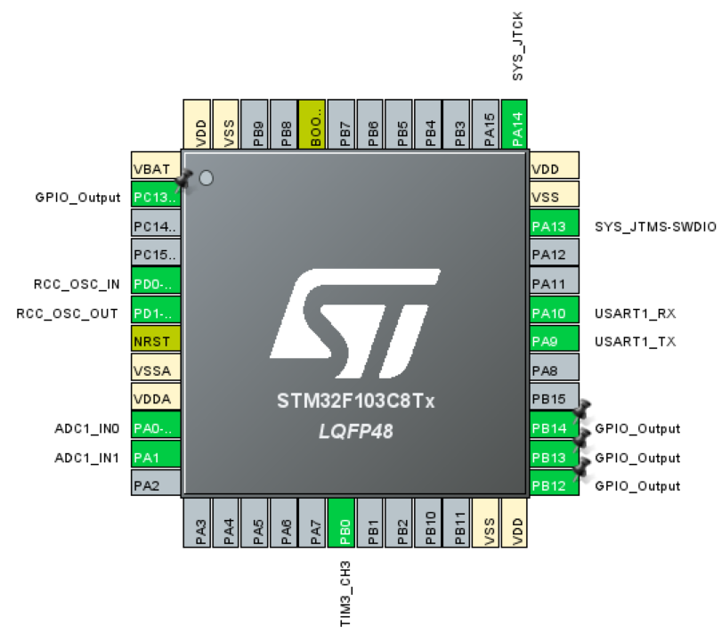

# STM32 Cube MX 配置清单

> 根据接口文档进行的配置，项目里已经配置好了

| 引脚 | 功能       | 外设      | 状态 | 备注                  |
| :--- | :--------- | :-------- | :--- | :-------------------- |
| PA0  | 土壤湿度   | ADC1_IN0  | ✅    | 必须接 3.3V           |
| PA1  | 光敏传感器 | ADC1_IN1  | ✅    | 必须接 3.3V           |
| PA9  | 蓝牙 TX    | USART1_TX | ✅    |                       |
| PA10 | 蓝牙 RX    | USART1_RX | ✅    |                       |
| PB0  | 风扇 PWM   | TIM3_CH3  | ✅    | 注意复用功能          |
| PB12 | DHT11 数据 | GPIO      | ⚠️    | 需外部上拉，3.3V 电平 |
| PB13 | 水泵继电器 | GPIO      | ✅    |                       |
| PB14 | 风扇继电器 | GPIO      | ✅    |                       |
| PC13 | 系统 LED   | GPIO      | ✅    | 低电平点亮            |
| PA13 | SWDIO      | 调试      | ✅    | 保留                  |
| PA14 | SWCLK      | 调试      | ✅    | 保留                  |




## 1. 时钟树

```
HSE：8 MHz
PLL Source Mux：HSE
PLLMUL：×9
系统时钟源选择：PLLCLK
系统时钟（SYSCLK）设置到最大值：72 MHz
HCLK：72 MHz
PCLK1：36 MHz（APB1 总线时钟）
PCLK2：72 MHz（APB2 总线时钟）

最终配置：
- SYSCLK：72 MHz
- HCLK：72 MHz
- PCLK1：36 MHz
- PCLK2：72 MHz
```


## 2. 系统核心

- SYS：Debug → Serial Wire
- RCC：HSE → Crystal/Ceramic Resonator


## 3. GPIO

- PB12：GPIO_Output, Open Drain, Pull-up, Medium speed, High level（DHT11 数据线）
- PB13：GPIO_Output, Push Pull, No pull, Low speed, Low level（继电器控制引脚）
- PB14：GPIO_Output, Push Pull, No pull, Low speed, Low level（继电器控制引脚）
- PC13：GPIO_Output, Push Pull, Pull-up, Low speed, High level（系统 LED）


## 4. 定时器（风扇 PWM）

- TIM3：Channel3 → PWM Generation CH3
- 参数：Prescaler=71, Counter Period=999


## 5. 串口（蓝牙、调试 / WiFi）

- USART1：
  - Asynchronous
  - 波特率：9600

- USART2：
  - Asynchronous
  - 波特率：115200
  - NVIC -> USART2 global interrupt


## 6. ADC（土壤湿度和光敏传感器）

- ADC1：IN0 和 IN1 启用
- Scan Conversion Mode：Enabled
- Continuous Conversion Mode：Enabled
- DMA Continuous Requests：Enabled
- Number Of Conversion：2
- Rank1：Channel 0, 239.5 Cycles
- Rank2：Channel 1, 239.5 Cycles


## 7. DMA（ADC 数据传输）

- ADC1：一个 DMA 请求
- Mode：Circular
- Data Width：Half Word (Both Peripheral and Memory)
- Memory Increment Address：Enable


## 8. FreeRTOS

### 8.1 内核

| 参数路径                | 参数名                | 推荐值                 | 说明                                              |
| :---------------------- | :-------------------- | :--------------------- | :------------------------------------------------ |
| **`Config Parameters`** | **`TOTAL_HEAP_SIZE`** | **`8192`**             | **堆内存大小（单位：字节）。传感器+蓝牙任务较多** |
| `Config Parameters`     | `USE_PREEMPTION`      | `Enabled`              | 抢占式调度，必须开启                              |
| `Config Parameters`     | `CPU_CLOCK_HZ`        | 自动匹配（HAL 会定义） | 无需修改                                          |
| `Config Parameters`     | `TICK_RATE_HZ`        | `1000`                 | 系统节拍 1ms，适合毫秒级延时                      |
| `Config Parameters`     | `MAX_TASK_NAME_LEN`   | `16`                   | 任务名字符串长度，够用即可                        |
| `Config Parameters`     | `USE_MUTEXES`         | `Enabled`              | 后面可能会用到互斥锁保护共享资源                  |
| `Config Parameters`     | `USE_SEMAPHORES`      | `Enabled`              | 信号量支持                                        |
| `Config Parameters`     | `USE_CO_ROUTINES`     | `Disabled`             | 协程已过时，不用                                  |

### 8.2 任务（Task）

| 参数                   | 任务 1：传感器读取     | 任务 2：控制逻辑    | 任务 3：通信处理                        |
| :--------------------- | :--------------------- | :------------------ | :-------------------------------------- |
| Task Name              | `Task_SensorRead`      | `Task_Control`      | `Task_Comm`                             |
| Entry Function         | `StartTask_SensorRead` | `StartTask_Control` | `StartTask_Comm`                        |
| Stack Size (Words)     | `256`                  | `256`               | `512`（因为蓝牙协议解析需要较大栈）     |
| Priority               | `osPriorityNormal`     | `osPriorityNormal`  | `osPriorityAboveNormal`（通信响应要快） |
| Parameter              | `NULL`                 | `NULL`              | `NULL`                                  |
| Code Generation Option | `As weak`              | `As weak`           | `As weak`                               |

### 8.3 队列（Queue）

#### 8.3.1 传感器数据

| 参数              | 值                      | 说明                                                   |
| :---------------- | :---------------------- | :----------------------------------------------------- |
| Queue Name        | `Queue_SensorData`      | 全局队列句柄名                                         |
| Queue Size        | `1`                     | 控制任务每次只读最新数据，1 个缓冲区即可（覆盖旧数据） |
| Item Size (Bytes) | `sizeof(AllSensorData)` | 结构体大小，可先填 `128`（根据实际结构体大小调整）     |
| Queue Type        | `Queue`                 | 标准队列（也可选消息队列，本质一样）                   |

> Item Size 临时填一个大数字，为让 CubeMX 生成队列的初始化代码，防止语法检查报错
>
> 生成代码后，**找到 `freertos.c` 队列定义并修改**
>
> ```
> osMessageQueueId_t Queue_SensorDataHandle;
> // ...
> Queue_SensorDataHandle = osMessageQueueNew(1, 128, NULL);
> ```
>
> 为
>
> ```
> #include "sensor_types.h"
> Queue_SensorDataHandle = osMessageQueueNew(1, sizeof(AllSensorData), NULL);
> ```

#### 8.3.2 蓝牙接收

| 参数              | 值                  | 说明                       |
| :---------------- | :------------------ | :------------------------- |
| Queue Name        | `Queue_BluetoothRx` | 存放从蓝牙串口收到的字节   |
| Queue Size        | `128`               | 接收缓冲区大小，防止丢数据 |
| Item Size (Bytes) | `1`                 | 每个元素是 uint8_t 字节    |
| Queue Type        | `Queue`             |                            |

> 蓝牙发送可以不使用队列，直接在任务中调用 `HAL_UART_Transmit`（阻塞）或使用中断发送
>
> 在串口中断回调中放入队列，而不是直接调用 `Bluetooth_ReceiveByte`（避免中断里做复杂处理）


## 9. 项目管理

1. Project：
   - Project Name：SmartPlantGuard
   - Toolchain/IDE：CMake
2. Code Generator：
   - ✅ Generate peripheral initialization as a pair of '.c/.h' files per peripheral