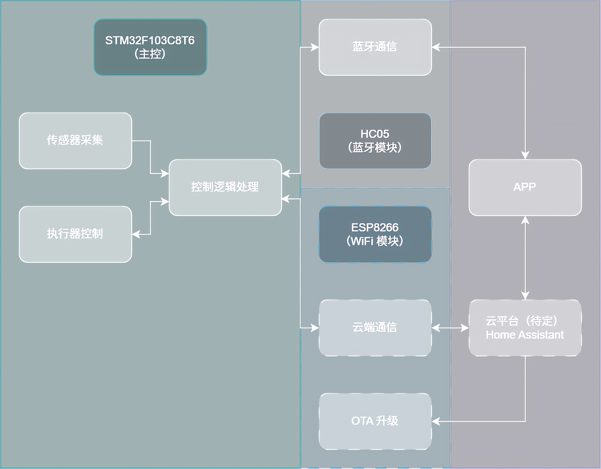

# 《智能植保微环境控制器》项目方案

## 1. 整体架构设计



1. **蓝牙 + WiFi 双模**：
   - **先做蓝牙**：使用 HC-05 蓝牙模块，通过手机蓝牙串口 APP 直接调试和控制
   - **保留 WiFi 接口**：PCB 上预留 ESP8266 的接口和空间，作为进阶功能
2. **模块化分布式开发**：
   - 将整个系统拆分成**完全独立**的功能模块
   - 每个模块都可以单独开发、单独测试
   - 使用**面包板 + 杜邦线**先独立测试，做模块验证，再整合到 PCB


## 2. 阶段实施步骤

### 2.1 阶段 1：模块独立开发（参考接口文档）

1. 传感器模块

   - **核心任务**：STM32 最小系统 + 控制逻辑
   - **实现步骤**：
     1. 搭面包板接传感器
     2. 完善接口
     3. 串口循环输出
   - **交付验证**：例如手沾水→串口湿度值变化
   - **具体内容**：
     1. 土壤湿度传感器（ADC）
     2. DHT11 温湿度传感器（单总线）
     3. 光敏电阻（ADC）
     4. 继电器驱动电路（三极管驱动）
     5. 风扇控制（PWM）
     6. 补光灯控制（可选）

2. 执行器模块（核心控制模块）

   - **核心任务**：所有传感器 + 执行器的接口与驱动

     >原任务书中的内容，看看就行：
     >
     >1. 方案一：继电器驱动电路（基础必做）
     >   - 实现要求：使用三极管（如 S8050）驱动 5V / 12V 继电器
     >   - 考核重点：必须包含续流二极管保护电路；理解继电器物理隔离的原理
     >   - 功能：实现水泵的完全开启或完全关闭
     >2. 方案二：MOSFET 驱动电路（进阶选做，加分项）
     >   - 实现要求：使用逻辑电平 MOSFET（如 IRLZ44N）构建开关电路
     >   - 考核重点：栅极下拉电阻的设计；PWM 调速控制的实现
     >   - 功能优势：除了开关控制外，需通过 PWM 调节水泵流量或风扇转速（例如：温度越高，风扇转得越快）

   - **实现步骤**：

     1. 搭面包板接继电器 + 执行器
     2. 完善接口
     3. 串口输入触发

   - **交付验证**：例如输入指令→水泵转动

   - **具体内容**：

     1. STM32 最小系统搭建
     2. 滞回控制算法实现
     3. 系统主循环和任务调度
     4. 本地存储

3. 通信模块

   - **核心任务**：蓝牙通信
   - **实现步骤**：
     1. 搭面包板接 HC-05
     2. 完善接口，蓝牙发送
     3. 手机 APP 接收数据
   - **交付验证**：手机蓝牙串口 APP 收到数据
   - **具体内容**：
     1. 蓝牙模块（HC-05）与 STM32 通信
     2. 手机端蓝牙串口 APP 配置
     3. WiFi 模块通信（如有余力）

### 2.2 阶段 2：模块集成

1. **接口对齐编译**

2. **物理连接整合**：

   ```
   传感器板 ---（杜邦线）---> 控制板
   控制板 ---（串口）----> 蓝牙模块
   ```

3. **联合调试**：

   - 测试完整流程：传感器 → 控制逻辑 → 蓝牙输出
   - 测试反向流程：手机命令 → 蓝牙 → 控制逻辑 → 执行器

### 2.3 阶段 3： PCB 设计与整体优化

1. 基于验证好的电路，设计 PCB 原理图
   - 重点：电源设计、继电器驱动、蓝牙模块接口，需预留 WiFi 接口
   - 硬件规范：PCB 走线需区分信号线与动力线，大电流路径需铺铜加粗
   - 硬件稳定性：PCB 必须有明确的信号地和功率地划分，严禁在执行器启动时导致单片机重启
2. 下单打样
3. 焊接 PCB，移植代码
4. 稳定性测试

### 2.4 阶段 4：进阶（有时间就做）

1. 电流监测
2. 通信模块替换
3. Home Assistant 搭建、测试 HA 控制指令
4. OTA 升级

### 2.5 阶段 5：文档整理与演示准备

1. 整理代码
2. 制作演示视频
3. 编写项目报告
4. 准备答辩 PPT


## 3. 硬件清单（按需购买）

- 主控：STM32 系列开发板
- 传感器：电容式土壤湿度传感器、DHT11 温湿度、光敏电阻
- 执行器：5V 继电器、小型水泵、5V 小型风扇、补光灯条
- 电源：12V 1A 电源适配器 + DC 插座
- PCB 组件：LM2596 / MP2307（DCDC）、AMS1117-3.3（LDO）、三极管、二极管、电感电容包


## 4. 代码规范

- 命名习惯（重要）：

  - 文件：`snake_case`

    ```
    comm_module.h
    wifi_mqtt.cpp
    ```

  - 宏 / 常量 / 枚举值：`UPPER_SNAKE_CASE`

    ```
    #define APP_TICK_MS 1U
    #define UART_RX_BUF_SIZE 128U
    enum { STATE_IDLE, STATE_RUN, STATE_ERROR };
    ```

  - 处理函数：`AaaAaa_AaaAaa`

    ```
    SensorManager_Init();
    TaskScheduler_Run();
    ```

  - 辅助函数 / 变量：`pascalCase`，函数推荐“动词名词”形式

    ```
    void getTemperature();
    bool isMotorRunning;
    int dataLength;
    ```

  - 结构体 / 枚举：`PascalCase`

    ```
    typedef struct { ... } MotorConfig;
    typedef enum { ... } AppState;
    ```

- 注释习惯（重要）：

  - 每个函数上方使用文档注释（直接用快捷键或右键使用 AI 生成注释）

  - 注释规范

    ```
    //行级注释 ×
    // 行级注释 √
    /*块级注释*/ ×
    /* 块级注释 */ √
    ```

  - 中西文混排的间距规范：中英文、中文与数字之间添加空格

    ```
    // CPU使用率 ×
    // CPU 使用率 √
    // 参考电压3.3V ×
    // 参考电压 3.3V √
    ```

  - 标点符号规范：中文注释使用中文符号，英文注释使用英文符号，特别是 `：`、`（）`、`，`，注释末尾不加句号或其它标点

    ```
    // 这是一个注释,它是中文的 ×
    // 这是一个注释，它是中文的。×
    // 这是一个注释(它是中文的) ×
    // 这是一个注释:它是中文的 ×
    // 这是一个注释，它是中文的 √
    // 这是一个注释（它是中文的）√
    // 这是一个注释：它是中文的 √
    // This is a comment, it is in Chinese √
    ```

- 写完代码之后使用 Ctrl + Alt + O 优化导入，再用一次 Ctrl + Alt + L 格式化代码（见 5.1）


## 5. Git 规范及开发流程

使用 GitHub 进行协作，主分支只保留稳定代码，功能开发在个人分支进行，有三个分支：

- `feature/sensor-module`：传感器模块
- `feature/actuator-module`：执行器模块
- `feature/comm-module`：通信模块

```
main                           # 稳定版本，只接受合并
│
├── feature/sensor-module      # 传感器模块总分支
│   ├── feature/sensor-soil    # 土壤湿度传感器
│   ├── feature/sensor-dht11   # 温湿度传感器
│   └── feature/sensor-light   # 光敏传感器
│
├── feature/actuator-module    # 执行器模块总分支
│   ├── feature/relay-pump     # 水泵继电器
│   ├── feature/pwm-fan        # 风扇 PWM 控制
│   └── feature/relay-light    # 补光灯控制
│
├── feature/controller-module  # 控制逻辑模块
│   ├── feature/hysteresis     # 滞回控制算法
│   ├── feature/task-scheduler # 任务调度器
│   └── feature/flash-storage  # Flash 存储
│
├── feature/comm-module        # 通信模块
│   ├── feature/bluetooth-hc05 # 蓝牙通信
│   └── feature/wifi-esp8266   # WiFi 通信，预留
│
├── feature/pcb-design         # PCB 设计文件
│
├── feature/integration        # 模块整合与联调
│
├── docs/                      # 文档更新分支
│
└── release/                   # 发布分支，用于最终版本打包
```

提交规范（与代码注释规范类似）：

```
Feat: 完成了 XXX
```

使用流程（参考，建议用 IDE 里面可视化界面操作）：

1. **拉取最新代码**：每天开始工作前，先从主分支拉取最新的代码，防止代码冲突

   ```
   git checkout main
   git pull origin main
   ```

2. **切回自己的分支**

   ```
   git checkout feature/sensor_module
   ```

3. **合并主分支到自己的分支**（这一步很重要，为了让你的草稿跟上正文进度）：

   ```
   git merge main
   ```

4. 写代码

   - **严格遵守代码规范**
   - 遵循接口约定

5. **提交并推送**

   ```
   git add .
   git commit -m "Feat: 完成了土壤湿度传感器的 ADC 读取"  # 提交信息要写清楚
   git push origin feature/sensor_module
   ```


## 6. Tips

### 6.1 CLion 常用快捷键

> 如果用 VS Code，安装 IntelliJ IDEA Keybindings 的插件，更多快捷键可见 `IDEA 常用快捷键`

1. `Ctrl` + `F`：在当前文件进行文本查找
2. **`Ctrl` + `R`：在当前文件进行文本替换**
3. `Ctrl` + `Z`：撤销
4. `Ctrl` + `Y`：删除光标所在行或选中的行
5. **`Ctrl` + `D`：复制光标所在行或复制选择内容，并把复制内容插入光标位置下面**
6. **`Ctrl` + `P`：方法参数提示显示**
7. `Ctrl` + `+`：展开代码
8. `Ctrl` + `-`：折叠代码
9. **`Ctrl` + `/`：注释光标所在行代码，会根据当前不同文件类型使用不同的注释符号**
10. **`Alt` + `Enter`：智能修复**
11. `Alt` + `左方向键`：按左方向切换当前已打开的文件视图
12. `Alt` + `右方向键`：按右方向切换当前已打开的文件视图
13. `Shift` + `Shift`：项目中查找文件、代码
14. **`Ctrl` + `Alt` + `L`：格式化代码，可以对当前文件和整个包目录使用**
15. **`Ctrl` + `Alt` + `O`：优化导入的类，可以对当前文件和整个包目录使用**
16. **`Ctrl` + `Alt` + `T`：对选中的代码弹出环绕选项弹出层**
17. `Ctrl` + `Alt` + `左方向键`：退回到上一个操作的地方
18. `Ctrl` + `Alt` + `右方向键`：前进到上一个操作的地方
19. `Ctrl` + `Shift` + `R`：根据输入内容替换对应内容，范围为整个项目或指定目录内文件
20. **`Ctrl` + `Shift` + `/`：代码块注释**

### 6.2 AI 编码工具推荐

可以在 CLion 或 VS Code 中装插件，也可以下载其专门的 IDE，推荐使用插件

如果喜欢折腾：

1. Antigravity / Gemini（学生认证免费）
2. CodeX（军人认证免费）
3. **GitHub Copilot（学生认证免费）**

如果不想折腾：

1. **Tongyi Lingma（免费）**
2. **Trae CN / Trae（免费）**
3. CodeGeeX（免费）